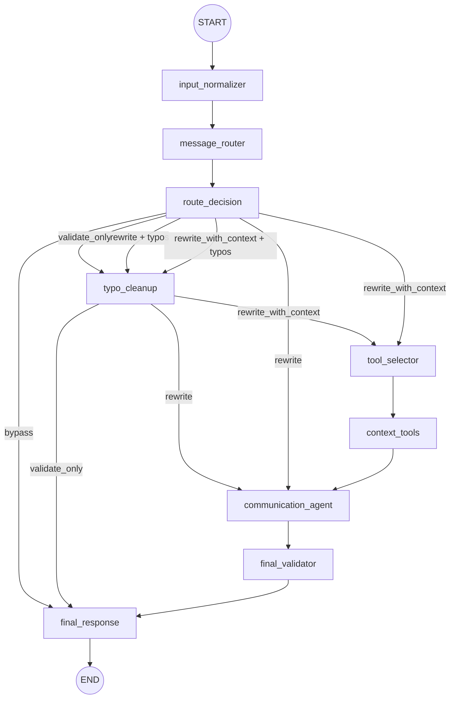

# Communication Agent Graph

The message analyzer now runs through a LangGraph-style workflow behind the existing `MessageAnalyzer.analyze(...)` entrypoint.

Flow:



The fast paths avoid LLM calls for greetings, acknowledgements, and typo-only drafts. The `rewrite` and `rewrite_with_context` paths reuse the existing LLM analysis and persistence behavior, with retrieved context passed into the existing prompt payload only when the router and tool selector decide it is relevant.

Runtime metadata is stored on `Message.raw_llm_response["agent_metadata"]`, including route, executed nodes, tools called, LLM/tool flags, per-node latency, total latency, validator status, and errors.

Useful commands:

```bash
python manage.py benchmark_communication_agent
python manage.py communication_agent_metrics
```

Optional W&B Weave tracing can be enabled with:

```bash
export WEAVE_TRACING=true
export WEAVE_PROJECT=your-team/communication-agent
export WANDB_API_KEY=<your-api-key>
```

When enabled, Weave receives one trace for the whole graph run and nested traces for graph nodes. Logged inputs are intentionally compact: message length, route, selected tools, receiver/company identifiers, and runtime metadata. Full prompts and raw documents are not sent by the graph instrumentation.

Inline-preview calls are traced separately as `communication_agent.inline_preview`.

Check local configuration with:

```bash
python manage.py weave_status
python manage.py weave_status --send-test-trace
```
